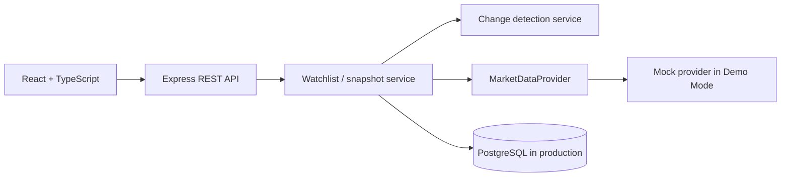

# PULSE

> **Know what changed. Not just what's happening.**

PULSE is a focused market watchlist that persists a user's prior observation, compares it to the latest valid quote on the server, and brings attention to material change. It is intentionally an awareness product—not a trading terminal or investment-advice product.

## Run locally

```bash
npm install
npm run dev
```

Open `http://localhost:5173`. No keys, database, or paid service are needed for Demo Mode. The API runs on port 3001; `npm test` runs the business-logic tests and `npm run build` produces a production web build.

## Persistent production mode

Create a free Supabase PostgreSQL project, copy its connection string into `DATABASE_URL`, set a long random `JWT_SECRET`, and run `npm run start`. PULSE automatically applies the idempotent schema; the equivalent SQL is also in `db/migrations/001_init.sql`. In this mode, register via `POST /api/auth/register` with a 12+ character password, then pass the returned JWT as `Authorization: Bearer <token>`. Users, watchlists, symbols, observations, and change events persist across restarts and devices.

## Demo flow

The initial watchlist contains RELIANCE, TCS, and INFY. Their baseline observations are saved. Expand **Developer demo controls**, choose **Advance market**, and the deterministic provider moves to these repeatable quotes: RELIANCE is significant, TCS moderate, and INFY normal. Toggle stale or failure to inspect transparent data-quality behavior. **Mark as seen** records the current quote as the next personal baseline.

## Product decision

Conventional watchlists make users recalculate changes in their heads. PULSE puts the personal comparison first: `+₹58 since your last check`, with the old snapshot accessible and separate from the market-provider timestamp. Rows are sorted by change score; normal entries are still present but quieter.

## Architecture



This repository implements a small modular monolith and a deterministic `MockMarketDataProvider`. Its provider boundary (`quote` / `history`) lets a free real provider later be normalized behind the same interface. Demo Mode uses an in-memory store so the evaluator path stays reliable; configured PostgreSQL mode uses the repository and authentication middleware already included.

## Change detection

The server owns the calculation. The score is a normalized, configurable weighted blend: price movement 40%, volume 25%, volatility 20% (with weights renormalized when a source omits a signal). Thresholds: 0–29 normal, 30–59 moderate, 60–100 significant. The explanation lists only calculated drivers; no AI-generated financial commentary is used.

## Data quality and failure handling

PULSE labels fresh, stale, and unavailable quotes. A failed provider never becomes ₹0 or a fake live value; the saved observation remains available and comparison is withheld. A production adapter should apply response validation, short-lived shared caching, request coalescing, and provider-specific rate limiting before values reach snapshot logic.

## REST surface

`GET /api/health`, `GET /api/watchlist`, `POST/DELETE /api/watchlist/:symbol`, `GET /api/market/:symbol`, `GET /api/market/:symbol/history`, `POST /api/observe`, `POST /api/demo/advance`, and `POST /api/demo/mode/:mode`.

## Production persistence & security plan

PostgreSQL mode persists `users`, `watchlists`, `watchlist_items`, `market_snapshots`, and `change_events`. Foreign keys and a unique `(watchlist_id, symbol)` constraint protect relationships and duplicate prevention; writes that create a snapshot and its computed event occur in one transaction. Passwords are bcrypt-hashed, JWTs expire after eight hours, and every user-scoped route derives its user ID from a verified token rather than request input. For a public deployment, set a unique `JWT_SECRET`, restrict `WEB_ORIGIN`, and use HTTPS.

## Engineering trade-offs

- PostgreSQL fits the relational user/watchlist/snapshot history and transactional writes.
- REST is sufficient for a compact, conventional resource API.
- A modular monolith keeps the essential provider, detection, and persistence boundaries understandable without distributed-service overhead.
- Snapshots are non-negotiable: without an observed baseline, “since last check” has no personal meaning.
- Backend classification avoids inconsistent client decisions and protects configurable business rules.
- Demo Mode is a product reliability feature: reviewers can validate the full experience during provider outages.

For larger scale, add a shared cache, background ingestion, provider circuit breakers, durable job processing, structured observability, and stronger rate limits—only when traffic requires them.
